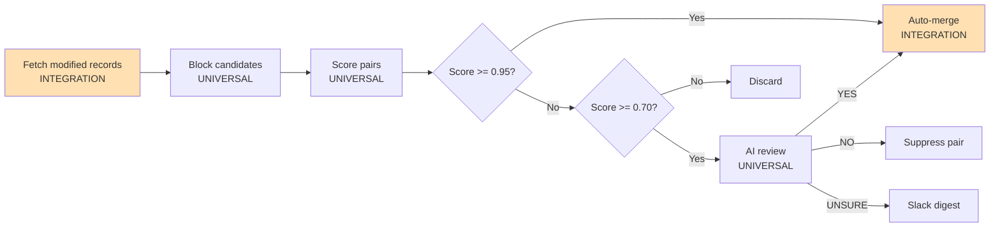

# CRM Dedup Agent — Setup Guide

> Built by [Andy Toizer](https://freckle.io) at Freckle. Andy runs this on his own HubSpot (84K contacts) and open-sourced it so others don't have to build it from scratch. If you get it running or build something clever on top of it, he genuinely wants to hear from you — more on that at the bottom.

---

## What This Tool Does

Finds and merges duplicate contacts and companies in your CRM. Runs on a 4-hour schedule, auto-merges high-confidence matches (exact email, LinkedIn URL, exact domain), uses Claude AI to review fuzzy matches, and posts a daily Slack digest of anything that needs human eyes.

Originally built for HubSpot. The core logic — scoring, blocking, AI review, audit logging — is CRM-agnostic. If you're on a different platform, you'll swap two files.

---

## Architecture



Orange = HubSpot-specific (swap these for your platform). White = universal logic (keep as-is).

---

## Guided Setup

### Step 1: What CRM Are You On?

This was built for HubSpot. The universal core works with any CRM that has contacts and companies with fields like email, phone, name, and LinkedIn URL.

**If you're on HubSpot:** skip to Step 3.

**If you're on something else:** you'll need to adapt two files:
- `pipeline/fetcher.py` — replace HubSpot Search API calls with your CRM's API
- `pipeline/merger.py` — replace HubSpot merge API calls with your CRM's equivalent

Both files have adaptation headers at the top explaining exactly what to change and what to preserve.

| If you're on... | What changes |
|---|---|
| HubSpot (original) | Nothing — use as-is |
| Salesforce | Replace fetcher with SOQL queries, merger with merge API |
| Pipedrive | Replace fetcher with Pipedrive People/Organizations API |
| Something else | Need: paginated contact/company fetch + a merge endpoint |

### Step 2: Adapt the Integration Layer (non-HubSpot only)

#### `pipeline/fetcher.py`
Fetches all contacts and companies with pagination. Uses HubSpot Search API with date-cursor chunking to bypass the 10K record limit.

**What to change:** The `_fetch_objects()` function — swap the API endpoint, auth header, and response parsing. Keep the generator pattern and the normalized record shape (return dicts with keys: `id`, `email`, `firstname`, `lastname`, `company`, `phone`, `hs_linkedin_url`, `lastmodifieddate`, etc.).

**What to preserve:** The chunked cursor pattern — most CRMs have similar pagination limits.

#### `pipeline/merger.py`
Executes the actual merge via API and writes the audit log.

**What to change:** `_hs_merge()` — swap the HubSpot merge endpoint with your CRM's. `_hs_patch()` — swap with your CRM's property update endpoint.

**What to preserve:** The `execute_merge()` interface, pre-merge property copy logic, and audit log write. The rest of the system calls `execute_merge()` — don't change its signature.

### Step 3: Map Your Fields

The scorer uses these internal field names. Update `config/settings.py` with your CRM's equivalent:

| Internal Field | Used For | HubSpot Property |
|---|---|---|
| `email` | Email exact match | `email` |
| `hs_linkedin_url` | LinkedIn dedup | `hs_linkedin_url` |
| `lemlistlinkedinurl` | LinkedIn dedup (alt source) | `lemlistlinkedinurl` |
| `phone` / `mobilephone` | Phone dedup | `phone`, `mobilephone` |
| `firstname` / `lastname` | Fuzzy name match | `firstname`, `lastname` |
| `company` | Company name (on contact) | `company` |
| `domain` | Company domain dedup | `domain` |
| `linkedin_company_page` | Company LinkedIn dedup | `linkedin_company_page` |
| `num_associated_deals` | Master selection weight | `num_associated_deals` |
| `hs_email_replied` | Engagement signal | `hs_sales_email_last_replied` |
| `hs_last_sales_activity_timestamp` | Activity multiplier | `hs_last_sales_activity_timestamp` |
| `num_notes` | Completeness signal | `num_notes` |

### Step 4: Configure Your Environment

```bash
cp .env.example .env
```

Fill in:

- **`HUBSPOT_ACCESS_TOKEN`** — HubSpot private app token. Create one at Settings → Integrations → Private Apps. Scopes: `crm.objects.contacts.read/write`, `crm.objects.companies.read/write`.
- **`ANTHROPIC_API_KEY`** — From [console.anthropic.com](https://console.anthropic.com). Keep this separate from your Claude Code key to avoid rate limit conflicts.
- **`SLACK_BOT_TOKEN`** — Optional. If blank, digests print to stdout. Get from api.slack.com → Your Apps → OAuth & Permissions. Scopes: `chat:write`.
- **`SLACK_REVIEW_CHANNEL`** — e.g. `#hubspot-dedup-review`
- **`DB_PATH`** — SQLite path, default `./dedup.db` is fine.

### Step 5: Initialize the Database

```bash
python -c "from db.database import init_db; init_db()"
```

### Step 6: Test

```bash
# Run the test suite
python -m pytest tests/ -v

# Dry-run on 500 records (safe, no changes)
python agents/bulk_dedup_agent.py --limit 500

# Check what would be merged
python review/preview_merges.py --limit 20
```

Good signs: scoring looks reasonable, master record selection picks the more active record.

### Step 7: Go Live (staged rollout)

```bash
# Start with 10 merges — spot check them
python agents/bulk_dedup_agent.py --live --max-merges 10

# If those look good, remove the cap
python agents/bulk_dedup_agent.py --live

# Process the review queue with AI
python review/ai_review.py --live
```

### Step 8: Set Up the Scheduler

In Claude Code, the incremental agent runs every 4 hours automatically via the scheduled tasks. It fetches only records modified since the last run, auto-merges the obvious ones, then runs AI review on the queue.

To register manually: `python scheduler/register_schedule.py`

---

## If HubSpot Still Shows Dupes

Export directly from HubSpot's dedup tool (Data Quality → Duplicates → Export) and run:

```bash
python review/merge_from_csv.py --contacts path/to/contacts.csv --live
python review/merge_from_csv.py --companies path/to/companies.csv --live
```

This handles HubSpot-identified pairs specifically, without re-running the full pipeline.

---

## What Stays the Same (Universal Files)

| File | What It Does |
|---|---|
| `pipeline/scorer.py` | Scoring algorithms, fuzzy matching, master selection |
| `pipeline/blocker.py` | Candidate pair generation — avoids O(n²) comparisons |
| `pipeline/web_enricher.py` | Follows redirects, scrapes LinkedIn/phone from homepages |
| `db/models.py` | SQLAlchemy ORM: audit_log, review_queue, agent_runs, known_non_duplicates |
| `db/database.py` | SQLite session management |
| `review/ai_review.py` | 3-stage AI pipeline: fast rules → web research → Claude Haiku |
| `tests/` | Test suite — 35 tests covering scoring and blocking |

## What Needs Adapting (Integration Files)

| File | What It Does |
|---|---|
| `pipeline/fetcher.py` | HubSpot API pagination and field normalization |
| `pipeline/merger.py` | HubSpot merge API execution |
| `config/settings.py` | HubSpot field names and API configuration |
| `review/slack_digest.py` | Posts to Slack (swap for your notification channel) |
| `review/merge_from_csv.py` | Parses HubSpot's CSV export format |

---

## Key Rules

- **Never merge without writing to audit_log first** — `merger.py` handles this automatically
- **Default is dry-run** — always pass `--live` explicitly to execute real merges
- **Auto-merge threshold: 0.95** — only exact signal matches cross this
- **Review threshold: 0.70–0.94** — goes to AI review
- **Master selection** — engagement score × 3.0 multiplier if any activity. The active record always wins.
- **HubSpot merge limit** — 250 merges per record max. The agent flags records approaching this.

---

## Common Commands

```bash
# Dry-run bulk scan (safe)
python agents/bulk_dedup_agent.py

# Dry-run on 500 contacts only
python agents/bulk_dedup_agent.py --limit 500

# Live bulk scan (execute real merges)
python agents/bulk_dedup_agent.py --live

# Live with safety cap
python agents/bulk_dedup_agent.py --live --max-merges 10

# Run incremental agent
python agents/incremental_dedup_agent.py --live

# AI review queue
python review/ai_review.py --live

# Merge from HubSpot CSV export
python review/merge_from_csv.py --contacts file.csv --live
python review/merge_from_csv.py --companies file.csv --live

# Preview proposed merges
python review/preview_merges.py --limit 20

# Review queue actions
python review/queue_action.py list
python review/queue_action.py approve 42 --live
python review/queue_action.py reject 42

# Run tests
python -m pytest tests/ -v
```

---

## Community

Andy built this to solve a real problem and open-sourced it so you don't have to start from scratch. A couple of things:

**If you get it running:** Andy likes knowing the tool is actually useful to real people. Feel free to send him a note — here's a canned message you can copy:

> Hey Andy — got crm-dedup-agent running. [X merges in the first run / running on X contacts]. Thanks for open-sourcing this.
>
> — [your name]

Send to: **andy@freckle.io**

**If you build something clever** — a better scoring signal, a smarter blocking strategy, a new AI review rule, anything you think other people would benefit from — Andy would love to see it and will likely roll it into the main repo for everyone. This project gets better when people share what they figure out.

Send improvements to: **andy@freckle.io**
