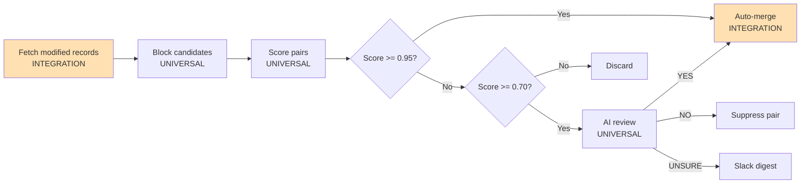

# CRM Dedup Agent

Built by [Andy Toizer](https://www.linkedin.com/in/andy-toizer/) — I write [Agent Operator](https://agentoperator.substack.com), a newsletter about what it actually looks like to build real systems with coding agents as a non-engineer, using live company data.

I built and tested this Dedupe Agent on [Freckle](https://freckle.io)'s live HubSpot data — 84K contacts, thousands of companies, 2,500+ duplicates merged on the first run.

**TLDR:** It finds and merges duplicate contacts and companies in your CRM, runs on a 4-hour schedule, auto-merges high-confidence matches, uses Claude AI to review fuzzy ones, and sends a daily Slack digest of anything that genuinely needs human eyes.

## What It Does

- **Always-on dedup** — incremental agent runs every 4 hours, only checking records modified since the last run
- **Tiered confidence** — exact email/LinkedIn/domain matches auto-merge; fuzzy name+company matches go to AI review
- **AI review pipeline** — fast CRM rules → web research (redirect following) → Claude Haiku reasoning
- **Master record selection** — engagement-weighted: the active record (deals, replies, notes) always wins
- **Audit log** — every merge is recorded with score, signals, and merged record ID
- **Slack digest** — daily summary of anything the AI left as genuinely uncertain

## How It Works



**Scoring priority (contacts):**
1. Email exact match → 1.0 → auto-merge
2. LinkedIn URL → 0.98 → auto-merge
3. Phone exact → 0.92 → auto-merge
4. Fuzzy name + company → up to 0.89 → AI review

**Scoring priority (companies):**
1. Domain exact → 1.0 → auto-merge
2. LinkedIn company page → 0.98 → auto-merge
3. Fuzzy name → up to 0.89 → AI review

## Quick Start

### Prerequisites
- Python 3.9+
- A HubSpot account (or adapt `pipeline/fetcher.py` + `pipeline/merger.py` for your CRM)
- An Anthropic API key (for AI review)
- Optionally: a Slack bot token for digests

### Setup

```bash
git clone https://github.com/your-username/crm-dedup-agent
cd crm-dedup-agent
pip install -r requirements.txt
cp .env.example .env
# Fill in your values
```

### Using Claude Code (recommended)

Open this project in [Claude Code](https://claude.ai/claude-code). The `CLAUDE.md` will walk you through the setup and help you adapt the integration layer if you're not on HubSpot.

### Run a dry-run first

```bash
# Safe — no changes made
python agents/bulk_dedup_agent.py

# Limit to 500 records for a quick test
python agents/bulk_dedup_agent.py --limit 500
```

### Go live

```bash
# Execute real merges (start small)
python agents/bulk_dedup_agent.py --live --max-merges 10

# Process the review queue with AI
python review/ai_review.py --live
```

## If HubSpot Still Shows Dupes

Export them directly from HubSpot's dedup tool (Data Quality → Duplicates → Export) and run:

```bash
python review/merge_from_csv.py --contacts path/to/contacts.csv --live
python review/merge_from_csv.py --companies path/to/companies.csv --live
```

## Adapting to Your Stack

The core logic — scoring, blocking, AI review, audit logging — is platform-agnostic. What's HubSpot-specific is `pipeline/fetcher.py` and `pipeline/merger.py`. See `CLAUDE.md` for a guided walkthrough.

## License

MIT — use it, fork it, improve it. If you build something cool, [let me know](mailto:andy@freckle.io).
